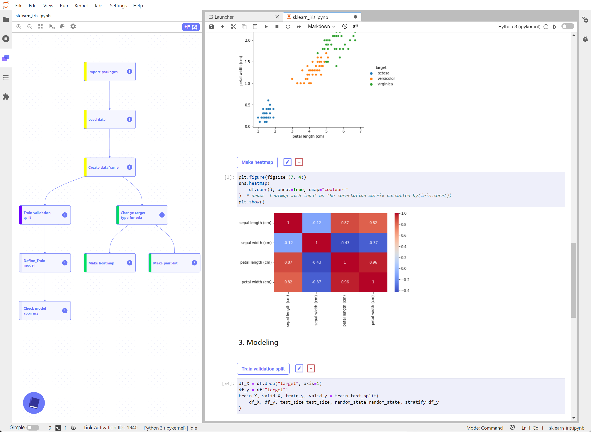

# Link Examples

Jupyter notebooks in this folder illustrate how to construct LinkTM pipelines when conducting exploratory data analysis or performing machine learning modelling task.

1. Spiral Pattern Classification ([notebook](spiral_classification.ipynb) [screenshot](#spiral-pattern-classification))
2. Iris Data EDA and Modelling ([notebook](sklearn_iris.ipynb) [screenshot](#iris-data-eda-and-modelling))
3. Titanic Data EDA and Modelling ([notebook](sklearn_titanic.ipynb) [screenshot](#titanic-data-eda-and-modelling))
4. Image Generation using Variational Autoencoder ([notebook](vae_mnist_generation.ipynb) [screenshot](#image-generation-using-variational-autoencoder))
5. Image Restoration using Denoising Autoencoder ([notebook](denoising_autoencoder_pytorch.ipynb) [screenshot](#image-restorationusing-denoising-autoencoder))
6. MNIST Image Classification using CNN ([notebook](cnn_mnist_classification.ipynb) [screenshot](#mnist-image-classification-using-cnn))
7. Using XGBoost for scikit-learn Datasets ([notebook](using-xgboost-with-scikit-learn.ipynb) [screenshot](#using-xgboost-for-scikit-learn-datasets))
8. Text Data Classification using RNN ([notebook](seq_classification.ipynb) [screenshot](#text-data-classification-using-rnn))
9. Deep Q-Network Reinforcement Learning for CartPole Environment ([notebook](DQLearning-cartpole-example.ipynb) [screenshot](#deep-q-network-reinforcement-learning-for-cartpole-environment))

## How to view a Link example notebook

1. Clone this repository to get all the example notebooks (`git clone https://github.com/makinarocks/link-example`)  
or download a notebook file you want to view as follows:
   - Click the notebook's link.
   - In the github-rendered page, click the mouse right button on the `raw` button and select "Save As..." menu.
   - Save the file as name of Jupyter notebook file type. (On the pop-up dialog, you need to change the extension from `.txt` to `.ipynb` manually.)
2. If you dont't have LinkTM installed on your local machine, first install the program. Visit LinkTM homepage for more information. (https://link.makinarocks.ai/)
3. Run LinkTM by executing `jupyter lab` on your terminal.
4. Open the downloaded notebook file.

The procedure above is roughly illustrated in the motion image below.

## How to use LinkTM

Please visit the Link introduction page at https://makinarocks.gitbook.io/link/v/en/.

---

### [Spiral Pattern Classification](spiral_classification.ipynb)

 

### [Iris Data EDA and Modelling](sklearn_iris.ipynb)

 

### [Titanic Data EDA and Modelling](sklearn_titanic.ipynb)

 

### [Image Generation using Variational Autoencoder](vae_mnist_generation.ipynb)

 

### [Image Restoration using Denoising Autoencoder](denoising_autoencoder_pytorch.ipynb)

 

### [MNIST Image Classification using CNN](cnn_mnist_classification.ipynb)

 

### [Using XGBoost for scikit-learn datasets](using-xgboost-with-scikit-learn.ipynb)

 

### [Text Data Classification using RNN](seq_classification.ipynb)

 

### [Deep Q-Network Reinforcement Learning for CartPole Environment](DQLearning-cartpole-example.ipynb)

