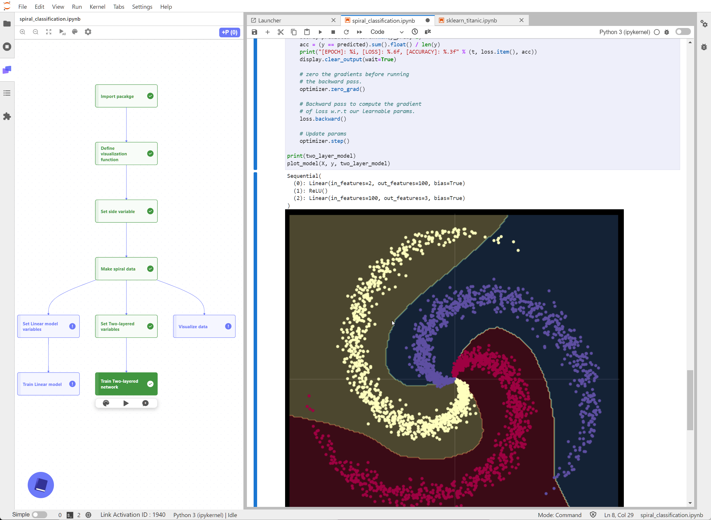
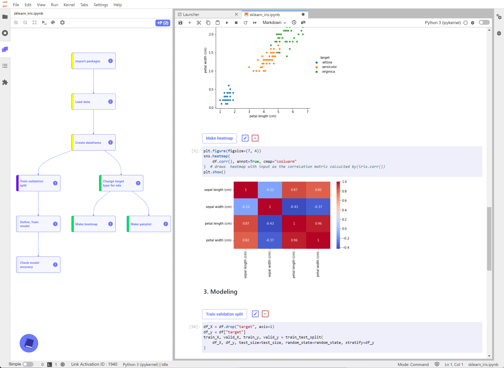
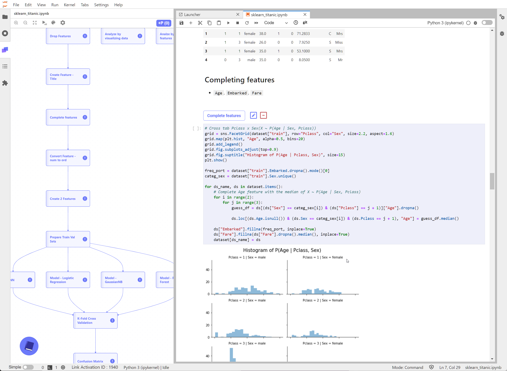
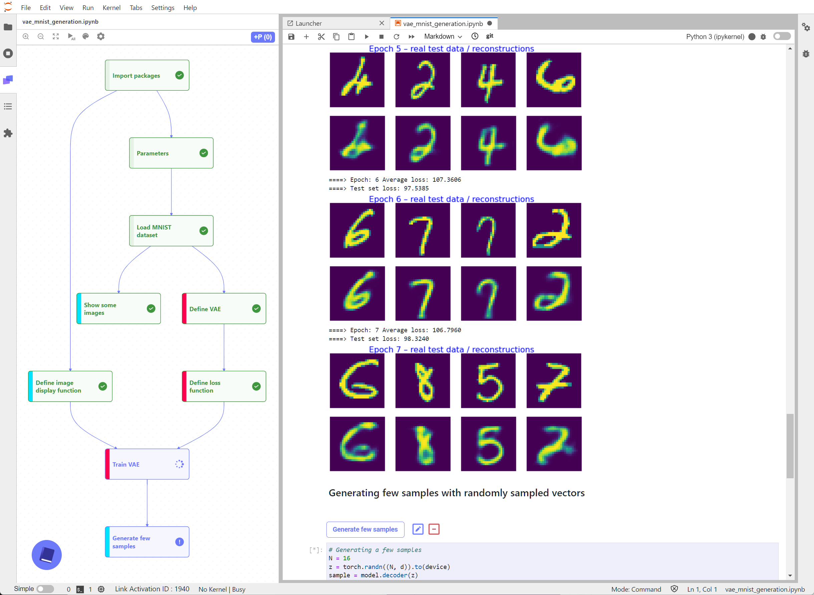
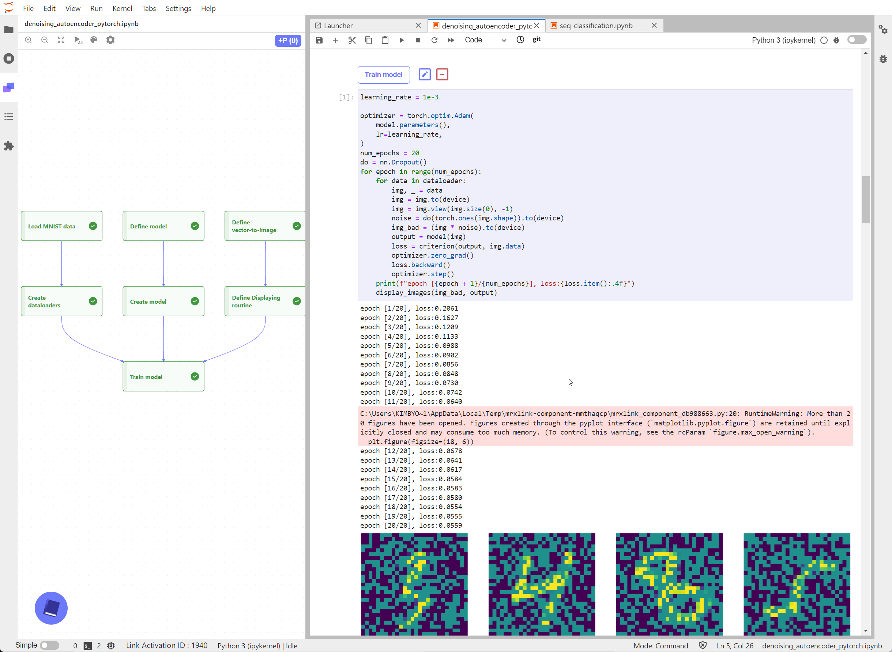
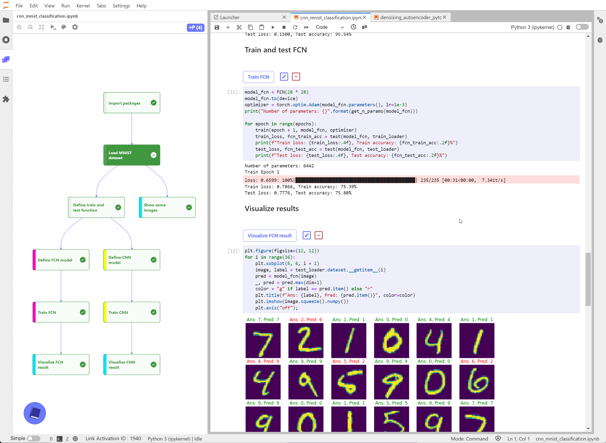
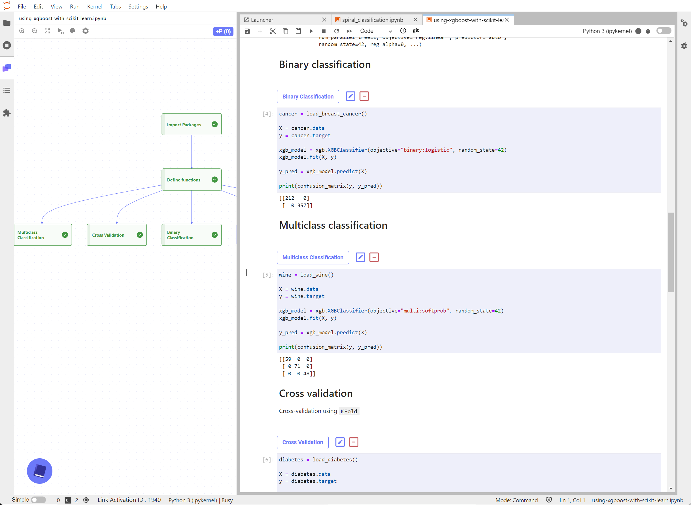
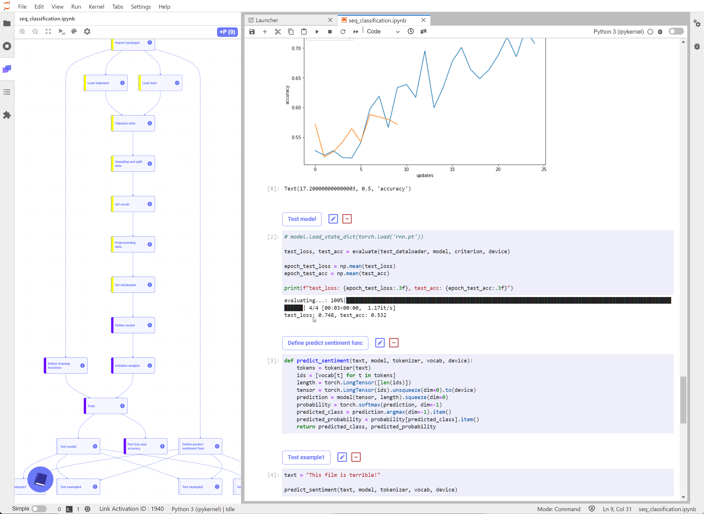
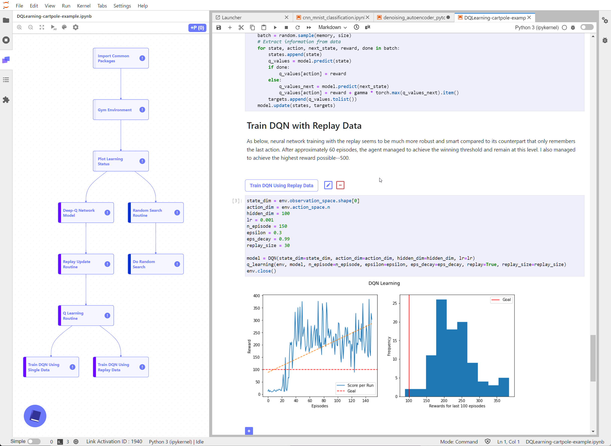

# Link Examples

Jupyter notebooks in this folder illustrate how to construct LinkTM pipelines when conducting exploratory data analysis or performing machine learning modelling task.

---

### [Spiral Pattern Classification](spiral_classification.ipynb)

 

### [Iris Data EDA and Modelling](sklearn_iris.ipynb)

 

### [Titanic Data EDA and Modelling](sklearn_titanic.ipynb)

 

### [Image Generation using Variational Autoencoder](vae_mnist_generation.ipynb)

 

### [Image Restoration using Denoising Autoencoder](denoising_autoencoder_pytorch.ipynb)

 

### [MNIST Image Classification using CNN](cnn_mnist_classification.ipynb)

 

### [Using XGBoost for scikit-learn datasets](using-xgboost-with-scikit-learn.ipynb)

 

### [Text Data Classification using RNN](seq_classification.ipynb)

 

### [Deep Q-Network Reinforcement Learning for CartPole Environment](DQLearning-cartpole-example.ipynb)

